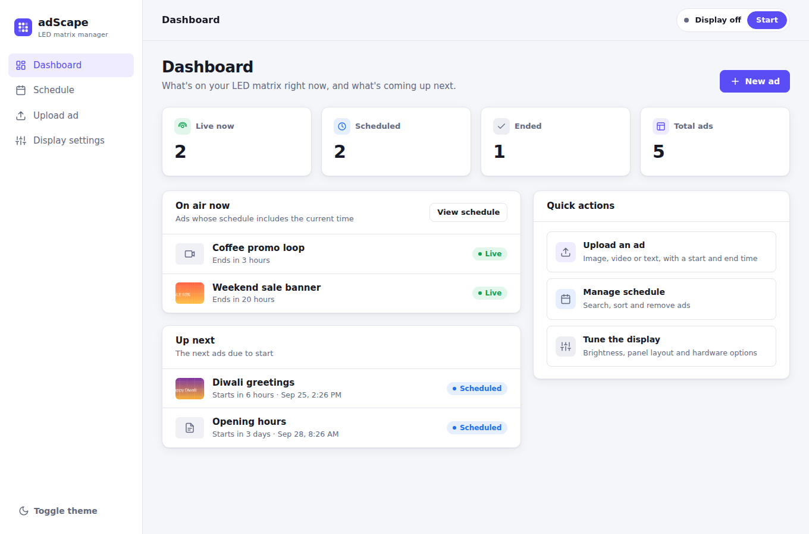
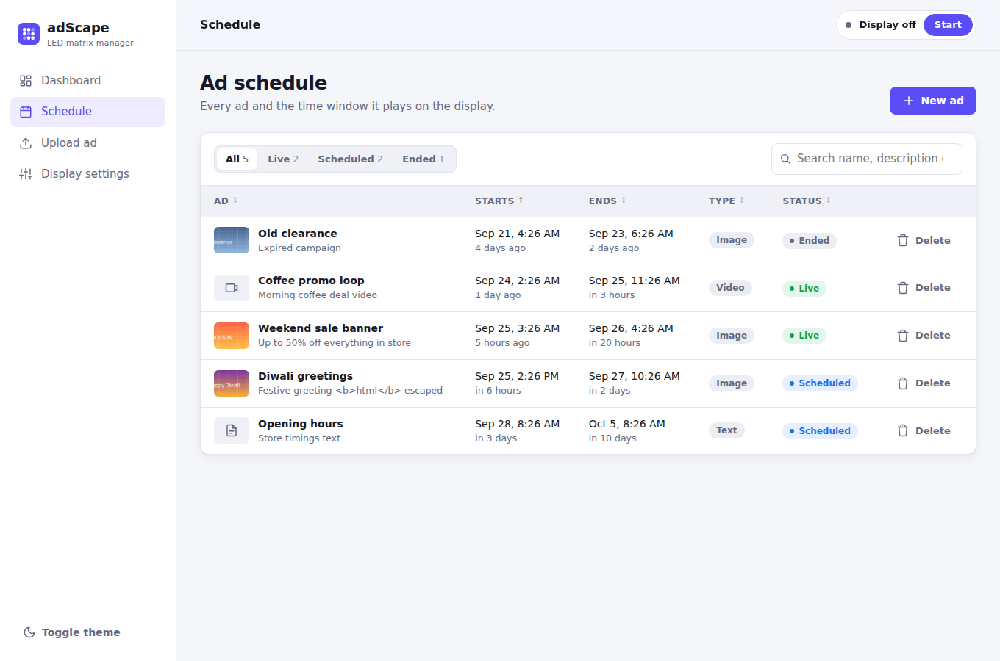
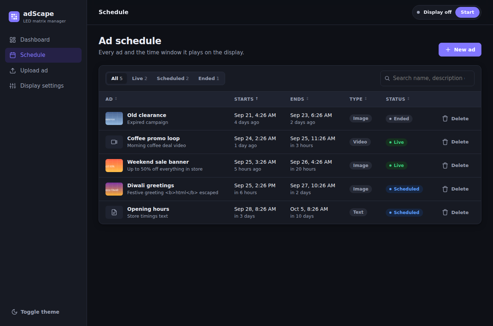
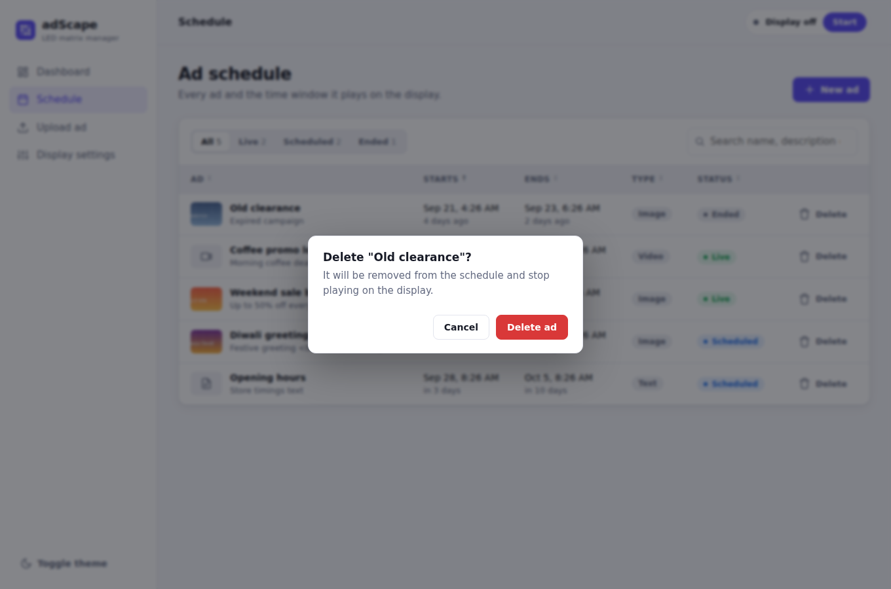
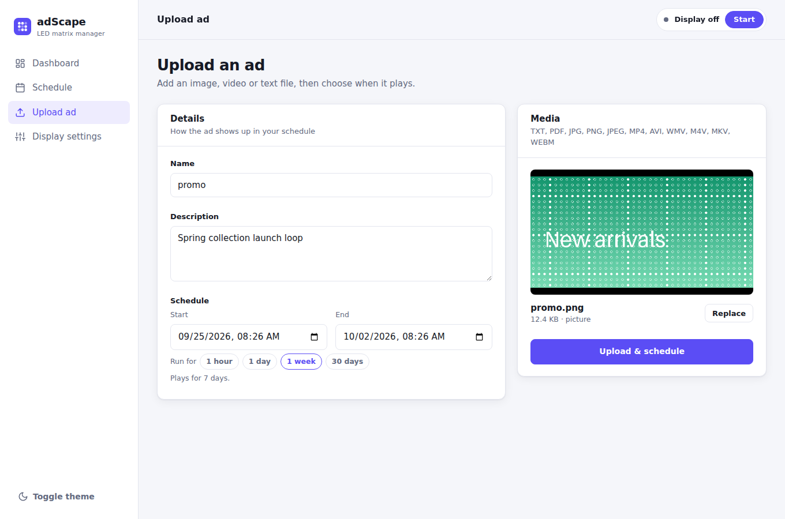
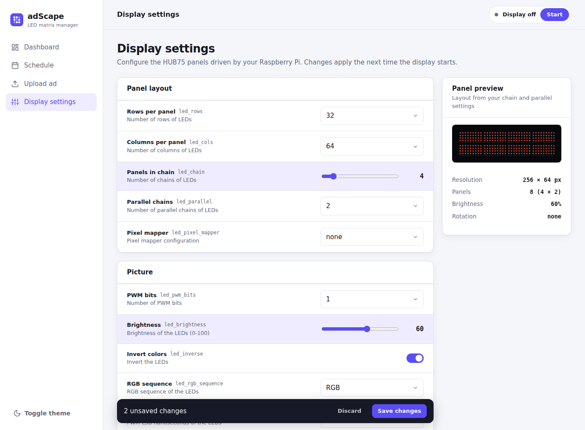
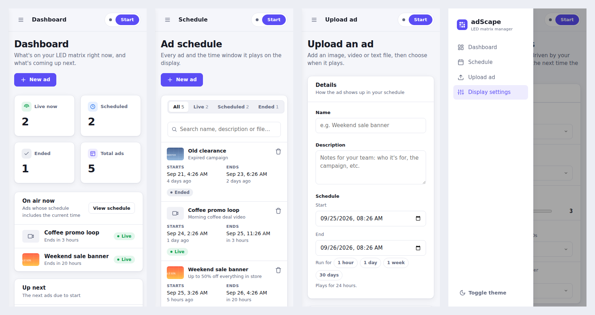

<div align="center">
  
</div>

# Raspberry Pi based HUB75 LED Matrix Display Management System (Fully OpenSource)


## Description
This project is a web-based system for managing and scheduling advertisements to be displayed on an LED matrix display. The system allows users to upload advertisements and specify a start and end time for them to be displayed.

## Screenshots

### Dashboard
See what's live on the display right now and what's coming up next.



### Schedule
Search, filter by status, and sort every ad. Deleting asks for confirmation first.



<details>
<summary>Dark theme and delete confirmation</summary>




</details>

### Upload an ad
Drag and drop a file, preview it, and set its time window with one-tap durations.



### Display settings
Grouped HUB75 panel settings with a live panel-layout preview and an unsaved-changes bar.



### On a phone
Every page works on a phone, and the sidebar becomes a slide-out menu.



## Features
- 🔒 User login and registration
- 📊 Dashboard showing what's live now and what's coming up next
- 📆 Drag-and-drop upload with media preview, quick duration presets and upload progress
- 🔎 Searchable, sortable schedule with live / scheduled / ended status
- 🌞 Grouped display settings with a live panel-layout preview and unsaved-change tracking
- ▶️ Start/stop the display from any page
- 🌗 Light and dark themes, responsive on phones, and no CDN dependencies (works on an offline Pi)

## Tech Stack
- **Frontend:** HTML (Jinja templates), vanilla CSS and JavaScript, with no external dependencies
- **Backend:** Python, Flask, MySQL

---

## Installation
1. **Clone the repository**
   ```sh
   git clone https://github.com/hemangjoshi37a/adScape.git
   ```
2. **Navigate to the project directory**
   ```sh
   cd adScape
   ```
3. **Install the required dependencies**
   ```sh
   pip install -r requirements.txt
   ```
4. **Configure your MySQL database auth details in `mysql_auth.py`**
   ```python
   mysql_username='root'
   mysql_password='mypasss'
   mysql_host='localhost'
   ```
5. **Run the application**
   ```sh
   python flaskBackend.py
   ```
6. **Access the application**
   ```
   http://localhost:5004
   ```

---

## Contributing
We welcome contributions to this project! Please follow these guidelines:

1. **Fork the repository and create a new branch**
2. **Ensure your code follows the [PEP 8](https://www.python.org/dev/peps/pep-0008/) style guide**
3. **Run the test suite to confirm that your changes don't break existing functionality**
4. **Open a pull request with a detailed description of your changes and any relevant issues addressed**

---

## License
This project is licensed under the MIT License. See the [LICENSE](LICENSE) file for more information.

---

## 📫 How to reach me
<div align="center">
  <a href="https://hjlabs.in/"></a>
  <a href="https://wa.me/917016525813"></a>
  <a href="https://t.me/hjlabs"></a>
  <a href="mailto:hemangjoshi37a@gmail.com"></a> 
  <a href="https://www.linkedin.com/in/hemang-joshi-046746aa"></a>
  <a href="https://www.facebook.com/hemangjoshi37"></a>
  <a href="https://twitter.com/HemangJ81509525"></a>
  <a href="https://www.tumblr.com/blog/hemangjoshi37a-blog"></a>
  <a href="https://stackoverflow.com/users/8090050/hemang-joshi"></a>
  <a href="https://www.instagram.com/hemangjoshi37"></a>
  <a href="https://in.pinterest.com/hemangjoshi37a"></a> 
  <a href="http://hemangjoshi.blogspot.com"></a>
  <a href="https://gitlab.com/hemangjoshi37a"></a>
</div>

---

## Checkout Cool GitHub Other Repositories:
Here's a list of some cool repositories you might be interested in:
- [pyPortMan](https://github.com/hemangjoshi37a/pyPortMan)
- [transformers_stock_prediction](https://github.com/hemangjoshi37a/transformers_stock_prediction)
- [TrendMaster](https://github.com/hemangjoshi37a/TrendMaster)
- [hjAlgos_notebooks](https://github.com/hemangjoshi37a/hjAlgos_notebooks)
- [AutoCut](https://github.com/hemangjoshi37a/AutoCut)
- [My_Projects](https://github.com/hemangjoshi37a/My_Projects)
- [Cool Arduino and ESP8266 or NodeMCU Projects](https://github.com/hemangjoshi37a/my_Arduino)
- [Telegram Trade Msg Backtest ML](https://github.com/hemangjoshi37a/TelegramTradeMsgBacktestML)

## Checkout Our Other Products:
We offer a variety of products:
- [WiFi IoT LED Matrix Display](https://hjlabs.in/product/wifi-iot-led-display)
- [SWiBoard WiFi Switch Board IoT Device](https://hjlabs.in/product/swiboard-wifi-switch-board-iot-device)
- [Electric Bicycle](https://hjlabs.in/product/electric-bicycle)
- [Product 3D Design Service with Solidworks](https://hjlabs.in/product/product-3d-design-with-solidworks/)
- [AutoCut : Automatic Wire Cutter Machine](https://hjlabs.in/product/automatic-wire-cutter-machine/)
- [Custom AlgoTrading Software Coding Services](https://hjlabs.in/product/custom-algotrading-software-for-zerodha-and-angel-w-source-code//)
- [SWiBoard :Tasmota MQTT Control](https://play.google.com/store/apps/details?id=in.hjlabs.swiboard)
- [Custom Token Classification or Named Entity Recognition (NER)](https://hjlabs.in/product/custom-token-classification-or-named-entity-recognition-ner-model-as-in-natural-language-processing-nlp-machine-learning/)

## Cool Arduino and ESP8266 (or NodeMCU) IoT projects:
Explore our innovative IoT projects:
- [IoT_LED_over_ESP8266_NodeMCU](https://github.com/hemangjoshi37a/my_Arduino/tree/master/IoT_LED_over_ESP8266_NodeMCU) : Turn LED on and off using a web server hosted on a nodemcu or esp8266
- [ESP8266_NodeMCU_BasicOTA](https://github.com/hemangjoshi37a/my_Arduino/tree/master/ESP8266_NodeMCU_BasicOTA) : Simple OTA upload code from Arduino IDE using WiFi to NodeMCU or ESP8266
- [IoT_CSV_SD](https://github.com/hemangjoshi37a/my_Arduino/tree/master/IoT_CSV_SD) : Read analog value of Voltage and Current and write it to SD Card in CSV format for Arduino, ESP8266, NodeMCU etc
- [Honeywell_I2C_Datalogger](https://github.com/hemangjoshi37a/my_Arduino/tree/master/Honeywell_I2C_Datalogger) : Log data in A SD Card from a Honeywell I2C HIH8000 or HIH6000 series sensor having external I2C RTC clock
- [IoT_Load_Cell_using_ESP8266_NodeMC](https://github.com/hemangjoshi37a/my_Arduino/tree/master/IoT_Load_Cell_using_ESP8266_NodeMC) : Read ADC value from High Precision 12bit ADS1015 ADC Sensor and Display on SSD1306 SPI Display as progress bar 

---

## HuggingFace Models & Datasets
### Models
- [hemangjoshi37a/autotrain-ratnakar_1000_sample_curated-1474454086](https://huggingface.co/hemangjoshi37a/autotrain-ratnakar_1000_sample_curated-1474454086) : Stock tip message NER using HUggingFace-AutoTrain

### Datasets
- [hemangjoshi37a/autotrain-data-ratnakar_1000_sample_curated](https://huggingface.co/datasets/hemangjoshi37a/autotrain-data-ratnakar_1000_sample_curated) : Stock tip message NER using HUggingFace-AutoTrain

---

## 🎥 Awesome YouTube Videos
- [❤️ હદય અને હદયના ધબકારા 💙 दिल और दिल की धड़कन 💖 Heart and beating of heart by Priyanka madam. 💕](https://www.youtube.com/watch?v=9v3MK6oTOeA)
- [🩸 રુધિર વહીનીઓ અને એના કર્યો. 🩸 Blood Vessels And Working of Blood Vessels 🩸 By Priyankama'am](https://www.youtube.com/watch?v=T7mMcEYNKyQ)
- [🩸 મનુષ્યમાં પરિવહન તંત્ર 🩸 परिसंचरण तंत्र 🩸 Blood Circulation System in Humans🩸 By Priyanka madam](https://www.youtube.com/watch?v=vxa6o_wrWnY)
- [AutoCut V2 - The World's Most Powerful Arduino Automatic Wire Cutting Machine](https://www.youtube.com/watch?v=oGr0mWmNhKY)
- [SWiBoard - A Killer Gadget to Boost Your Boring Switchboard](https://www.youtube.com/watch?v=ftza6WM4LiE)
- [🧪 મનુષ્યમાં ઉત્સર્જન-તંત્ર 🦠 मानव उत्सर्जन तंत्र ⚗️ excretory system 🩺](https://www.youtube.com/watch?v=UUGI-CFKsWI)
- [🌳વનસ્પતિમાં પાણી અને ખનીજ તત્વોનું વહન 🌲](https://youtu.be/1da9p6iYlr4)
- [🌲 વનસ્પતિમાં બાષ્પોત્સર્જન 🌳 पेड़ में वाष्पोत्सर्जन 🎄Transpiration in Trees](https://youtu.be/I9Sirc42Ktg)
- [🫁 સજીવોમાં શ્વસન 🧬 जीवों में श्वास 🫀 Breathing in organisms 👩🏻‍🔬](https://youtu.be/sIMl4t2OFmY)
- [🫁 શ્વસનની પ્રક્રિયા 🫀Respiratory System 🦠](https://youtu.be/hua8ZD5Ge1w)
- [🫁 મનુષ્યમાં શ્વાસ અને ઉચ્છશ્વાસ ⚛️](https://youtu.be/BI-CYgnkGCw)

---

## 📝 My Quirky Blog
- [Hemang Joshi](http://hemangjoshi.blogspot.com/)

---

## 📱 Awesome Android Apps
- [SWiBoard :Tasmota MQTT Control](https://play.google.com/store/apps/details?id=in.hjlabs.swiboard)

---

## Checkout Cool GitLab Other Repositories:
- [pyPortMan](https://gitlab.com/hemangjoshi37a/pyPortMan)
- [transformers_stock_prediction](https://gitlab.com/hemangjoshi37a/transformers_stock_prediction)
- [TrendMaster](https://gitlab.com/hemangjoshi37a/TrendMaster)
- [hjAlgos_notebooks](https://gitlab.com/hemangjoshi37a/hjAlgos_notebooks)
- [AutoCut](https://gitlab.com/hemangjoshi37a/AutoCut)
- [My_Projects](https://gitlab.com/hemangjoshi37a/My_Projects)
- [Cool Arduino and ESP8266 or NodeMCU Projects](https://gitlab.com/hemangjoshi37a/my_Arduino)
- [Telegram Trade Msg Backtest ML](https://gitlab.com/hemangjoshi37a/TelegramTradeMsgBacktestML)
